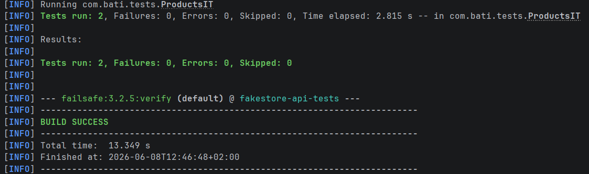

# FakeStore API Tests

Projekt automatycznych testów API dla https://fakestoreapi.com/

## Wymagania
- Java 17+
- Maven 3.8+
### Weryfikacja 
- java -version
- mvn -version
## Uruchomienie testów
mvn verify
### Przykładowe rezultat uruchomienia testu: 

## Generowanie raportu - Raport otworzy się automatycznie w domyślnej przeglądarce.
mvn allure:serve
### Przykładowy raport

---

## Technologie

| Narzędzie    | Wersja | Zastosowanie                  |
|--------------|--------|-------------------------------|
| Java         | 21     | Język programowania           |
| Maven        | 3.9.x  | Build tool                    |
| JUnit 5      | 5.10.2 | Framework testowy             |
| Rest-Assured | 5.4.0  | Testy REST API                |
| Allure       | 2.27.0 | Raportowanie                  |
| Failsafe     | 3.2.5  | Uruchamianie testów (faza IT) |